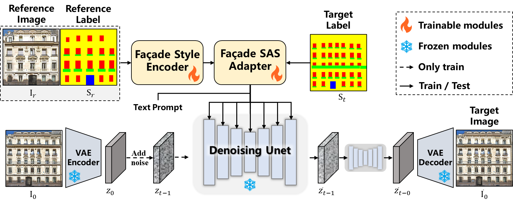
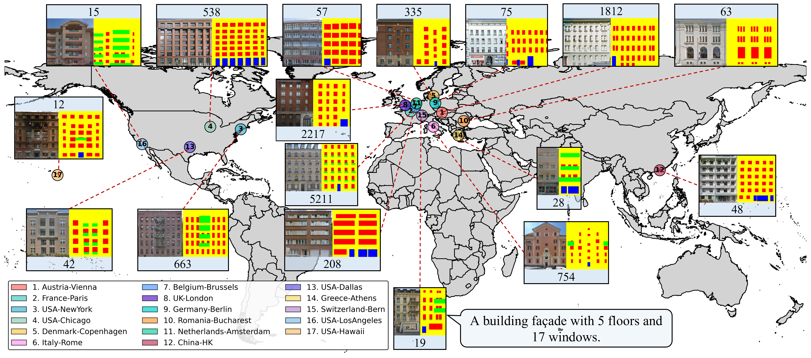

# SAGE-Façade

> **SAGE-Façade**: \textbf{S}emantic-\textbf{A}ligned \textbf{G}uidance for \textbf{E}xemplar-based Façade Synthesis.  

## 🔥 Highlights

* 🚀 **A Novel Paradigm for Structured Generation:** We introduce **SAGE-Façade**, a unified diffusion-based framework that breaks the bottleneck of global style injection by achieving precise, category-level semantic-aligned soft guidance for highly structured images.
* 🧩 **Class-Wise Feature Routing:** Through our proposed **SASE** (Structure-Aware Style Encoder) and **SASA** (Semantic-Aligned Style Adapter), the model adaptively disentangles and routes specific style priors, fundamentally eradicating cross-category "style bleeding".
* 📐 **Anti-Aliasing Soft Downsampling:** We propose **SSD** (Soft Semantic Downsampling), transforming hard discrete labels into continuous spatial probability distributions to preserve sub-pixel physical boundaries during multi-scale diffusion perfectly.
* 📊 **The LSAA-12K Benchmark:** We release a large-scale, meticulously refined dataset comprising ~12,000 high-quality building façades with pixel-level semantic masks, serving as a robust new benchmark for the community.
* 🏆 **State-of-the-Art Performance:** Extensive experiments demonstrate that SAGE-Façade achieves unprecedented structural fidelity, multi-view 3D consistency, and strong zero-shot cross-dataset generalization.

  

---

## 🏢 LSAA-12K Dataset

**LSAA-12K** provides **12097 building façade images** with paired **semantic labels and text prompts**.

- The **test split** of LSAA-12K can be downloaded from [Google Drive](https://drive.google.com/drive/folders/1PLhzE8qJrwigYaXsqC40buLZRlF5H3B6?hl=zh-cn).
- The **train split** of LSAA-12K is coming soon.

  

---

## 📌 News
- **2026-01-25**: Initial public repo template.
- **2026-03-16**: Provide the test split of LSAA-12K dataset .

---

## 🧩 Results at a glance

### Experiment setting 1: different reference façades + semantic layouts

  

### Experiment setting 2: center-cropped reference → full façade completion

  

---

## 📦 Data preparation

This repo is dataset-agnostic. You only need paired data:
- RGB façade image `I`
- semantic map `S` (integer labels or color-coded map)
- text prompt `T`

See [docs/DATASETS.md](https://github.com/yueyisui/FacadeDiffusion/blob/main/docs/DATASETS.md) for expected folder layout and label conventions.

---

## 🎬 LoD texture projection demo

  

▶️ **Full-resolution video**:  
[Download MP4](assets/lod_with_texture.mp4)

---

## 📊 Evaluation

- Semantic parsing metrics: mIoU / F1 / Precision / Recall / Accuracy
- Appearance consistency: LPIPS / CLIP-Score / FID / DINO / CLIP-IQA / CLIP-based multi-façade similarity (CLIP-MF), etc.

See: [docs/EVALUATION](https://github.com/yueyisui/FacadeDiffusion/blob/main/docs/EVALUATION.md).

---

## 🧾 License

- **Code**: Apache-2.0 (see [LICENSE](https://github.com/yueyisui/FacadeDiffusion/blob/main/LICENSE))  
- **Dataset**: CC BY-NC-SA 4.0 (derivative work based on LSAA).  
  See [docs/DATASETS.md](https://github.com/yueyisui/FacadeDiffusion/blob/main/docs/DATASETS.md).

---

## 🙏 Acknowledgements
- Built on top of the Diffusers / Accelerate ecosystem.
- Thanks to the authors of LSAA and related façade datasets.

